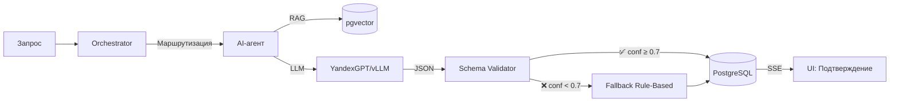
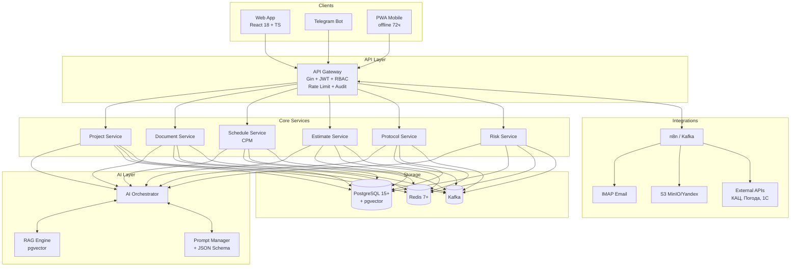
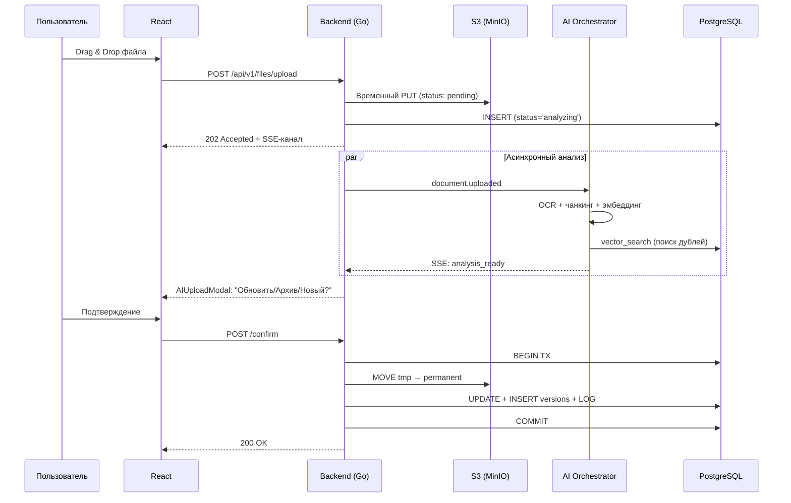

# Система управления строительством
AI-система управления строительством — это интеллектуальное приложение на базе Go для автоматизации процессов в строительстве. Оно помогает управлять проектами, оптимизировать ресурсы и минимизировать риски. Проект разработан как pet-project для демонстрации.

Возможности
- проектирование стадия П и Р: актуальный архив исходных данных, проектной и рабочей документации объекта
- дорожные карты и графики согласований документации, контроль и отслеживание устранения ошибок.
- Сметы: Автоматическое формирование и редактирование смет на основе вводных данных (проект).
- Графики: Построение Gantt-графиков для планирования этапов работ с учетом зависимостей. Анализ текущего производства работ с учетом количества людей и выработки, сравнение с графиком.
- Контроль ресурсов: Мониторинг запасов материалов, оборудования и персонала в реальном времени.
- Формирование необходимых документов для сдачи в эксплуатацию объекта, графики согласований строительных работ итд 
- Автоматический расчёт стоимости: Динамический расчет общей стоимости проекта с учетом инфляции и изменений цен.
- Мониторинг рисков: Анализ потенциальных рисков (погода, задержки поставок) с использованием простых ML-моделей для прогнозирования.


 Архитектура
- Микросервисная архитектура: Разделена на модули (сметы, графики, ресурсы, риски), каждый как отдельный сервис в Go.
- Backend: Go с использованием Gin для API, GORM для ORM (база данных PostgreSQL).
- AI-компоненты: Интеграция с внешними API (например, TensorFlow Serving через gRPC) для расчета рисков и стоимости. Локальные модели на Gonum для простых вычислений.
- Frontend: Простой веб-интерфейс на HTML/JS 
- Хранение данных: PostgreSQL для структурированных данных, Redis для кэширования графиков.
- Развертывание: Docker для контейнеризации, Kubernetes для оркестрации в продакшене.


 Инструменты и технологии
- Язык: Go 1.22+
- Фреймворки: Gin (HTTP), GORM (ORM), Gonum (математика/ML).
- Базы данных: PostgreSQL, Redis.
- AI/ML: Gonum для базовых моделей
- CI/CD: GitHub Actions.
- Тестирование: Go testing package, с покрытием >80%.
- Другие: Docker, Kubernetes, Prometheus для мониторинга, JWT для auth.


# 🏗️ Construction Manager AI

<div align="center">


-4169E1?style=for-the-badge&logo=postgresql&logoColor=white)


**Интеллектуальная AI-система управления строительным проектом**  
*Автоматизация полного цикла: от ИРД и проектирования до СМР и ввода в эксплуатацию*

[Быстрый старт](#-быстрый-запуск) • [Архитектура](#-архитектура) • [AI-агенты](#-ai-агенты) • [Документация](#-документация)

</div>

---

## 📌 О проекте

**Construction Manager AI** — это интеллектуальная платформа для **Технического заказчика, ГИПа, ПТО и прорабов**, автоматизирующая полный жизненный цикл капитального строительства:

```
ИРД → Проектирование (П → Экспертиза → Р) → СМР → Ввод в эксплуатацию
```

В отличие от классических ERP (1С:УСО, Адепт, ЦУС), система использует **мульти-агентную AI-архитектуру** на базе LLM + RAG, где ИИ работает в режиме **Human-in-the-Loop**: все критические действия требуют явного подтверждения пользователя.

---

## 🎯 Для кого этот проект

Это **production-grade pet-project**, демонстрирующий:

| Компетенция | Что реализовано |
|-------------|-----------------|
| **Senior Go-разработка** | Микросервисы, gRPC, Kafka, event-driven, presigned URL, circuit breaker |
| **AI/ML интеграция** | LLM + RAG + JSON Schema + Human-in-the-Loop + ONNX |
| **Production-ready** | S3-FMS, idempotency, retry/backoff, dead-letter queues |
| **Observability** | Prometheus + Grafana + OpenTelemetry + Jaeger + audit log |
| **DevOps** | Docker, Kubernetes, Helm, GitHub Actions, ArgoCD |
| **Безопасность** | JWT+RBAC, sanitization PII, 152-ФЗ, rate limiting |

> ⚠️ Проект **не является** готовым продуктом для продакшена, но архитектура и код готовы к масштабированию.

---

## ✨ Ключевые возможности

### 📄 Документооборот и Проектирование
- ✅ **S3-FMS** — интеллектуальный файловый менеджер (presigned URL, версионирование, SHA-256)
- ✅ **AI-валидация загрузки** — авто-классификация, сравнение версий, поиск дублей (cosine ≥ 0.82)
- ✅ **RAG-поиск** по 100К+ документов через `pgvector` (HNSW индекс)
- ✅ **Реестры ИРД / Стадия П / Стадия Р** с фильтрами `согл+текущий`
- ✅ **Дорожные карты согласований** с эскалацией просрочек

### 💰 Сметы и Финансы
- ✅ Авто-формирование черновиков **ССР** по Приказу №421/пр
- ✅ Парсинг спецификаций из РД (PDF/Excel)
- ✅ Интеграция с **КАЦ/СВОР** API (Redis cache, TTL 24ч)
- ✅ **EVM-калькулятор**: CPI, SPI, EAC, TCPI с доверительными интервалами
- ✅ Валидация арифметики смет + warnings

### 📅 Графики и СМР
- ✅ **CPM-график** (Gantt) с зависимостями FS/SS/FF/SF, лагами, критическим путём
- ✅ **Baseline vs Actual** — план-факт анализ с визуализацией
- ✅ Ежедневные отчёты прораба через **Telegram-бот**
- ✅ AI-прогноз срыва сроков (±3 дня, точность ≥85%)
- ✅ Ресурсное планирование + детекция перегрузок

### 📝 Протоколы совещаний
- ✅ Парсинг email (IMAP), загруженных файлов, аудиосообщений
- ✅ **NER-извлечение**: дата, участники, решения, ответственные, сроки
- ✅ Авто-создание задач в графике СМР/Проектирования
- ✅ Уведомления через Telegram + Web SSE

### ⚠️ Мониторинг рисков
- ✅ ML-прогноз (XGBoost/Prophet через ONNX)
- ✅ Источники: погода, логистика, кадры, SPI/CPI
- ✅ Реестр рисков с автоматической эскалацией
- ✅ Рекомендации по митигации (fast-tracking, crashing)

### 🏁 Ввод в эксплуатацию
- ✅ Дорожная карта с чек-листом обязательных документов
- ✅ Авто-проверка комплектности (СП 48.13330, ГОСТ Р 58033)
- ✅ Генерация актов КС-2/КС-3/КС-14, ЗОС
- ✅ Сокращение времени подготовки пакета: **с 5–7 дней до 1 дня**

---

## 🤖 AI-агенты (Human-in-the-Loop)

Система использует **мульти-агентную архитектуру** на базе LLM + RAG:

| Агент | Функция | Точность | SLA |
|-------|---------|----------|-----|
| 📄 **DocAgent** | Классификация документов, сравнение версий П/Р, выявление изменений | ≥95% | ≤15 сек |
| 💰 **CostAgent** | Парсинг спецификаций, черновики ССР, EVM-расчёт | ±5% | ≤3 сек |
| 📅 **ScheduleAgent** | CPM-график, прогноз срыва сроков, пересчёт критического пути | ±3 дня | ≤10 сек |
| 📝 **ProtocolAgent** | NER-извлечение задач из протоколов совещаний | ≥92% | ≤45 сек |
| ⚠️ **RiskAgent** | ML-прогноз рисков (погода, логистика, ресурсы) | ≥85% | ≤1 мин |
| 📊 **DashboardAgent** | Агрегация метрик, ТЭП, дашборды | 100% | ≤200 мс |

### Принципы работы AI



**Ключевые правила:**
- 🔒 Все `write`-действия требуют **явного подтверждения** пользователя
- 📊 Обязательные поля: `ai_confidence` (0.0–1.0) + `requires_human_review`
- 🛡 При `confidence < 0.7` → авто-переключение на fallback + ручной интерфейс
- 📝 Полный **audit log**: `prompt_hash`, `response_hash`, `user_decision`, `ip`, `latency_ms`
- 🚫 Запрет на галлюцинации: при отсутствии данных → прямой ответ «Данные не найдены»
- 🔐 Sanitization PII перед отправкой в LLM (152-ФЗ)

---

## 🏗 Архитектура

### Общая схема



### S3-FMS: Интеллектуальный файловый менеджер

В отличие от простого хранилища, S3 в системе работает как **событийный файловый менеджер**:



**Принцип:** `S3 = диск`, `БД = файловая система`, `ИИ = интеллектуальный администратор`

---

## 🔗 Интеграции

| Источник | Метод | Назначение |
|----------|-------|------------|
| **IMAP / Exchange** | n8n Poller (5 мин) | Парсинг входящих писем → ProtocolAgent |
| **КАЦ / СВОР** | HTTP API + Redis Cache | Актуализация цен для CostAgent |
| **Telegram Bot** | Bot API | Сбор факта СМР, уведомления, эскалация |
| **1С:Предприятие** | Webhook | Синхронизация актов, затрат |
| **Погода (Gismeteo)** | API | Триггеры для RiskAgent |
| **BIM / IFC** | ifc.js / xBIM | Clash detection, привязка к задачам |
| **MS Project / Primavera** | XML/MPX импорт | Синхронизация графиков |

---

## 🥊 Сравнение с рынком

| Критерий | 1С:ERP УСО | Адепт | ЦУС | Pragmacore | **Construction Manager AI** |
|----------|------------|-------|-----|------------|------------------------------|
| AI-анализ изменений РД | ❌ | ❌ | ❌ | Частично | ✅ LLM + RAG |
| Авто-создание задач из протоколов | ❌ | ❌ | Частично | ❌ | ✅ NER + JSON Schema |
| EVM-прогноз с ML | ❌ | ❌ | ❌ | ✅ | ✅ XGBoost/Prophet |
| Presigned URL + S3-FMS | ❌ | ❌ | ❌ | ❌ | ✅ Event-driven |
| Offline-first PWA | ❌ | Частично | ❌ | ❌ | ✅ 72 часа |
| RAG-поиск по 100К док. | ❌ | ❌ | ❌ | ❌ | ✅ pgvector HNSW |
| Human-in-the-Loop | ❌ | ❌ | ❌ | ❌ | ✅ Все write-действия |
| Стоимость (10 польз.) | ~780k ₽ | ~1.9M ₽ | Enterprise | ~960k ₽/год | **Open Source** |

---

## 🛠 Технологический стек

| Слой | Технология | Версия |
|------|------------|--------|
| **Backend** | Go + Gin + GORM v2 | 1.22+ |
| **БД (основная)** | PostgreSQL + pgvector | 15+ |
| **Кэш** | Redis | 7+ |
| **Очереди** | Kafka | 3.x |
| **Хранилище** | MinIO / Yandex Object Storage (S3) | - |
| **AI/ML** | vLLM / YandexGPT + Gonum + ONNX Runtime | - |
| **Парсинг** | pdfcpu + Apache Tika | - |
| **Frontend** | React 18 + TypeScript + Vite | - |
| **Mobile** | PWA + React Native (опционально) | - |
| **Интеграции** | n8n + IMAP + Telegram Bot API | - |
| **Инфра** | Docker + Kubernetes + Helm + GitHub Actions | - |
| **Observability** | Prometheus + Grafana + OpenTelemetry + Jaeger | - |
| **Тесты** | Go testing + k6 + Cypress + OWASP ZAP | - |

---

## 🗺 Roadmap

### ✅ Done (v0.3)
- [x] S3-FMS: presigned upload, версионирование, SHA-256
- [x] JWT + RBAC middleware (6 ролей)
- [x] Docker Compose (Postgres + Redis + MinIO + n8n)
- [x] CI/CD: GitHub Actions (lint + test + build)
- [x] Audit log всех write-операций

### 🚧 In Progress (v0.4)
- [ ] AI Orchestrator + JSON Schema валидатор
- [ ] DocAgent: сравнение версий П/Р
- [ ] ProtocolAgent: NER-извлечение задач
- [ ] pgvector + RAG-поиск по документам
- [ ] AIUploadModal flow с SSE

### 📋 Planned (v0.5–1.0)
- [ ] CostAgent: авто-черновики ССР + КАЦ
- [ ] ScheduleAgent: CPM-график + EVM
- [ ] RiskAgent: ML-прогноз (ONNX)
- [ ] Telegram Bot + PWA offline
- [ ] Prometheus + Grafana + OpenTelemetry
- [ ] Нагрузочное тестирование (k6)

### 🔮 Future (v2.0)
- [ ] Автогенерация документов для ввода в эксплуатацию
- [ ] BIM/IFC clash detection
- [ ] Расширенные ML-модели (Prophet, XGBoost ONNX)
- [ ] Мультипроектность + Tenant isolation
- [ ] White-label версия / SaaS

---

## 🚀 Быстрый запуск

### Предварительные требования
- Go 1.22+
- Docker + Docker Compose
- (Опционально) NVIDIA GPU для локальной LLM

### 1. Клонирование и настройка

```bash
git clone https://github.com/AleksKAG/construction-manager.git
cd construction-manager
cp .env.example .env
```

### 2. Запуск инфраструктуры

```bash
docker compose up -d
# Поднимает: PostgreSQL 15 + pgvector, Redis 7, MinIO, n8n
```

### 3. Запуск backend

```bash
go run ./cmd/api
```

### 4. Проверка

```bash
curl http://localhost:8080/api/v1/health
# {"status":"ok","version":"0.3.0","time":"2026-06-29T10:00:00Z"}
```

### Обязательные переменные окружения

```bash
# Auth/API
JWT_SECRET=change_me
SERVICE_API_KEY=change_me

# S3
S3_ENDPOINT=https://storage.teamweb.ru
S3_BUCKET=your-bucket
S3_SECRET_KEY=your-secret
S3_PREP_URL_TTL=1h
S3_GET_URL_TTL=24h

# AI (опционально)
AI_PROVIDER=yandexgpt          # или vllm
YANDEX_GPT_API_KEY=your-key
YANDEX_GPT_FOLDER_ID=your-folder-id

# БД
RUN_DB_MIGRATIONS=true
```

### Документные API

Все роуты находятся в защищённой группе `/api/v1/documents`:

| Метод | Эндпоинт | Описание |
|-------|----------|----------|
| `POST` | `/presigned-url` | Получение presigned URL для загрузки |
| `POST` | `/confirm` | Подтверждение загрузки после AI-анализа |
| `GET`  | `/download` | Получение presigned URL для скачивания |
| `POST` | `/compare` | Сравнение двух версий документа |

**Пример запроса presigned URL:**

```json
{
  "project_id": "cc82c3b2-992e-4f08-8da1-f35c2bd34755",
  "doc_type": "ird",
  "designation": "AR-001",
  "filename": "specification.pdf",
  "content_type": "application/pdf",
  "size": 73400320
}
```

---

## 🤖 Запуск AI-компонентов

### Локально (vLLM)

```bash
# Запуск локальной LLM (требует NVIDIA GPU)
docker run --gpus all -p 8000:8000 vllm/vllm-openai:latest \
  --model mistralai/Mistral-7B-Instruct-v0.2

# Настройка env
AI_PROVIDER=vllm
AI_ENDPOINT=http://localhost:8000/v1
AI_MODEL=mistralai/Mistral-7B-Instruct-v0.2
```

### Через облако (YandexGPT)

```bash
AI_PROVIDER=yandexgpt
YANDEX_GPT_API_KEY=your-key
YANDEX_GPT_FOLDER_ID=your-folder-id
```

### Fallback на rule-based

При недоступности LLM система автоматически переключается на **rule-based логику** с пометкой `requires_human_review: true`.

---

## 🔒 Безопасность

- ✅ **JWT + Refresh Token** (TTL 15 мин / 7 дней)
- ✅ **RBAC**: 6 ролей (`admin`, `tech_client`, `designer`, `estimator`, `contractor`, `viewer`)
- ✅ **Audit log** всех write-операций + AI-запросов
- ✅ **Sanitization PII** перед отправкой в LLM
- ✅ **Presigned URL** с TTL ≤15 мин
- ✅ **Шифрование** at-rest (S3) + in-transit (TLS)
- ✅ **Rate limiting**: 10 req/min/user
- ✅ **Соответствие 152-ФЗ** (локализация данных в РФ)
- ✅ **SAST/DAST** в CI/CD (trivy, OWASP ZAP)

---

## ⚡ Производительность (SLA)

| Операция | Требование (p95) |
|----------|------------------|
| API отклик | ≤200 мс |
| AI-анализ текста | ≤15 сек |
| OCR + анализ PDF | ≤45 сек |
| RAG-поиск (10k док.) | ≤2 сек |
| Загрузка 100 МБ файла | Resume support |
| Загрузка проекта с 1000 задачами | ≤3 сек |
| Поиск по 100К документов | ≤1 сек |

---

## 🧪 Тестирование

```bash
# Unit-тесты с покрытием
go test -cover ./...

# Integration-тесты (требует Docker)
docker compose -f docker-compose.test.yml up -d
go test -tags=integration ./...

# Нагрузочное тестирование
k6 run scripts/load/api.js

# Security scan
trivy fs --severity HIGH,CRITICAL .
```

**Требования к качеству:**
- 📊 Покрытие unit-тестами ≥80%
- 🔄 Integration-тесты для всех AI/ML модулей
- 🎭 E2E-тесты на Cypress/Playwright
- 🛡 SAST/DAST в каждом PR

---

## 📂 Структура проекта

```
construction-manager/
├── cmd/
│   └── api/                 # Точка входа
├── internal/
│   ├── ai/                  # AI Orchestrator + агенты
│   │   ├── orchestrator.go
│   │   ├── agents/          # Doc, Cost, Schedule, Protocol, Risk
│   │   ├── prompt_manager.go
│   │   └── validator.go     # JSON Schema
│   ├── domain/              # Бизнес-модели
│   ├── repository/          # GORM репозитории
│   ├── service/             # Бизнес-логика
│   ├── handler/             # HTTP handlers (Gin)
│   ├── middleware/          # auth, rbac, logging, audit
│   ├── integration/         # n8n, imap, s3, telegram
│   ├── model/               # GORM модели
│   └── utils/               # helpers
├── migrations/              # SQL миграции
├── seeds/                   # Тестовые данные (Онкоцентр)
├── docs/
│   ├── swagger.yaml
│   └── screenshots/
├── scripts/
│   └── load/                # k6 скрипты
├── docker-compose.yml
├── Dockerfile
├── .github/workflows/       # CI/CD
├── go.mod
└── README.md
```

---

## 📚 Документация

- [📘 API Reference (Swagger)](docs/swagger.yaml)
- [🤖 Промпт-библиотека AI](docs/prompts/)
- [🏗 Архитектура взаимодействия](docs/architecture.md)
- [📐 Структура БД](docs/database.md)
- [🎨 Структура Frontend](docs/frontend.md)
- [🔐 Безопасность и RBAC](docs/security.md)

---

## 🤝 Contributing

Проект открыт для контрибуций! См. [CONTRIBUTING.md](CONTRIBUTING.md)

1. Fork репозитория
2. Create feature branch (`git checkout -b feature/amazing-feature`)
3. Commit changes (`git commit -m 'Add amazing feature'`)
4. Push (`git push origin feature/amazing-feature`)
5. Open Pull Request

---

## 📄 Лицензия

MIT © [Квачёв Александр](https://github.com/AleksKAG)

---

## 👤 Автор

**Квачёв Александр** — Go-разработчик

- 🐙 GitHub: [@AleksKAG](https://github.com/AleksKAG)
- ✈️ Telegram: [@Kurtalex27](https://t.me/Kurtalex27)

---

<div align="center">

**Если проект оказался полезным — поставьте ⭐**

[⬆ Вернуться наверх](#-construction-manager-ai)

</div>
